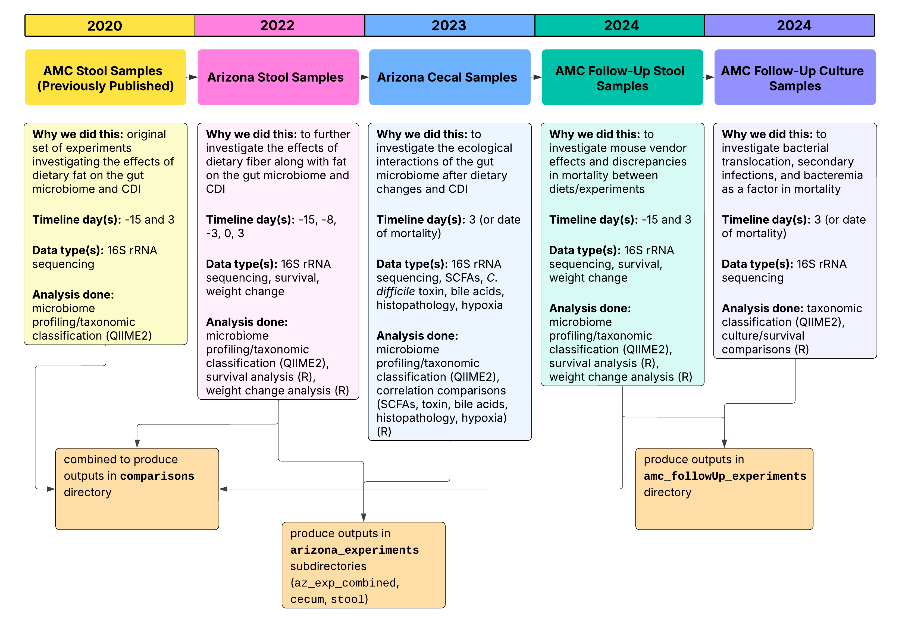

# The effects of dietary fat and fiber on the gut microbiome in the context of antibiotic-induced *C. difficile* infection

This repository includes all files produced through [QIIME2](https://qiime2.org/) microbiome profiling of 16S rDNA sequencing FASTQ files along with visualizations and statistical analysis run in R. Analysis was optimized through a pipeline generated in [Snakemake](https://snakemake.github.io/), associated files are contained in the workflow directory. 

## Directory contents are as follows:
> [!IMPORTANT] 
> Each directory contains a `README.md` file that includes additional information about the code/data provided.

- [**amc_followUp_experiments:**](https://github.com/madiapgar/diet_mouse_cdiff/tree/master/amc_followUp_experiments) Follow-up experiments conducted at AMC (Anschutz Medical Campus)
- [**arizona_experiments:**](https://github.com/madiapgar/diet_mouse_cdiff/tree/master/arizona_experiments) Main mouse experiments done at the University of Arizona 
- [**comparisons:**](https://github.com/madiapgar/diet_mouse_cdiff/tree/master/comparisons) A combination of baseline (day -15) and day 3 microbiome data from the Arizona experiments, AMC follow-up experiments, and previously published data from [this study](https://www.nature.com/articles/s41522-022-00276-1) to make comparisons between studies.
- [**figures:**](https://github.com/madiapgar/diet_mouse_cdiff/tree/master/figures) Compiled manuscript figures and the script used to produce them, plots taken from all directories.
- [**qiita:**](https://github.com/madiapgar/diet_mouse_cdiff/tree/master/qiita) QIITA sample and preparation metadata files and the script used to produce them (also can be downloaded directly from QIITA). 
- [**workflow:**](https://github.com/madiapgar/diet_mouse_cdiff/tree/master/workflow) Contains the pipeline built for the purpose of this data analysis in Snakemake (the [tutorial](https://github.com/madiapgar/diet_mouse_cdiff/blob/master/workflow/tutorial/tutorial.md) is here!).

## Links (will be hyperlinked once available):
- paper
- Raw 16S rRNA sequences on [QIITA](https://qiita.ucsd.edu/study/description/16008#)

## R Package: apppleplots
This project has an associated R package named [apppleplots](https://github.com/madiapgar/apppleplots) that contains functions to create the plots/stats seen in the paper (and this repo). All plots featured in the paper are also included in the package as `ggplot2` objects. 

## Contact Information: 
All code and subsequent outputs were generated by Madison Apgar, a graduate student in the Lozupone lab at the University of Colorado Anschutz Medical Campus.

- **LinkedIn:** Madi Apgar
- **Email:** madison.apgar@cuanschutz.edu

  
